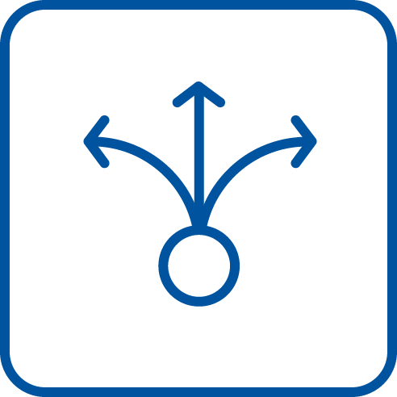

# CPM Scenario



The Datasetconverter is a Qt5 based GUI application with two main functions.
It allows to convert different datasets into CPM scenarios (a format based on the CommonRoad format) and to create or edit Lanelet2 maps for the CPM Lab.
The different data sets are converted on the fly into the CPM scenario format and visualised.
The user can then select a section of a recording to export a scenario. The data sets themselves must be downloaded separately from the various providers.

## Build

This tool is built with the common CMake command line interface of simillar tools.

```bash
cd <dir>
mkdir build
cd build
cmake ..
cmake --build .
```

The tool supports installation via the CMake command line interface of simillar tools.

```bash
cd <dir>
mkdir build
cd build
cmake .. --CMAKE_INSTALL_PREFIX="<install-dir>"
cmake --build . --target install
```

## Acknowledgements
We acknowledge the financial support for this project by the Exploratory Teaching Space of the RWTH Aachen University (Germany).

## References
* [1] A. Mokhtarian, S. Schäfer, B. Alrifaee. "CPM Olympics: Development of Scenarios for Benchmarking in
Networked and Autonomous Driving". 2022
